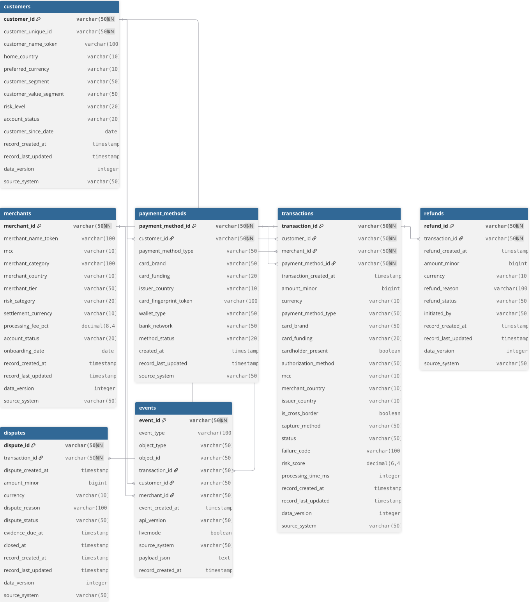

# 01 — Raw Source Data Model

## 1. Purpose

The Settlens raw source model represents an operational-style payment platform before warehouse-specific modelling is applied.

The source layer deliberately avoids:

- surrogate warehouse keys;
- fact/dimension structures;
- SCD `valid_from` / `valid_to` columns;
- precomputed BI KPIs;
- dashboard-specific denormalization.

This keeps the source contract close to the business events and entities that would later be supplied by Stripe or another payment processor.

## 2. Analyse the source data

### 2.1 Source entities

The current source contains seven main entities:

| Entity | Grain | Primary key | Main purpose |
|---|---|---|---|
| `customers` | one row per current customer | `customer_id` | customer account state and segmentation |
| `merchants` | one row per current merchant | `merchant_id` | merchant classification, geography and commercial attributes |
| `payment_methods` | one row per payment method | `payment_method_id` | cards, wallets and bank-transfer instruments owned by customers |
| `transactions` | one row per payment attempt | `transaction_id` | central payment attempt / authorization entity |
| `refunds` | one row per refund operation | `refund_id` | full or partial refund activity |
| `disputes` | one row per dispute case | `dispute_id` | chargeback and dispute lifecycle |
| `events` | one row per source event | `event_id` | append-only event stream for replay, deduplication and future webhook ingestion |

### 2.2 Main relationships

```text
customers 1 ----- N payment_methods
customers 1 ----- N transactions
merchants 1 ----- N transactions
payment_methods 1 ----- N transactions
transactions 1 ----- N refunds
transactions 1 ----- N disputes
transactions 1 ----- N events (when transaction-related)
customers 1 ----- N events (nullable relationship)
merchants 1 ----- N events (nullable relationship)
```

The `events.object_id` field is intentionally polymorphic and therefore is not a strict foreign key to only one table.

### 2.3 Redundancy and controlled duplication

Some transaction attributes duplicate descriptive information that also exists on parent entities, for example:

- `payment_method_type`
- `card_brand`
- `card_funding`
- `mcc`
- `merchant_country`
- `issuer_country`

This is intentional at the source-contract level because those values represent the **transaction-time snapshot**. A merchant or payment method can change later, while the historical transaction should keep the attributes that applied when the payment was attempted.

This is a good example of why modelling decisions should be based on business semantics rather than mechanically removing every repeated value.

## 3. Conceptual model

At the highest level, Settlens represents five payment-domain concepts:

1. **Customer** — owns or uses payment methods and initiates payment activity.
2. **Merchant** — receives payment attempts.
3. **Payment Method** — card, wallet or bank-transfer instrument used by a customer.
4. **Transaction** — a payment attempt connecting customer, merchant and payment method.
5. **Post-transaction lifecycle** — refunds, disputes and source events associated with the transaction.

The transaction is the central business process in the model.

## 4. Logical model

### 4.1 `customers`

Key analytical attributes include customer country, preferred currency, segment, value segment, risk level, account status and customer-since date.

Candidate slowly changing attributes downstream:

- `customer_segment`
- `customer_value_segment`
- `risk_level`
- `account_status`

### 4.2 `merchants`

Key attributes include merchant category code (MCC), merchant category, country, merchant tier, risk category, settlement currency, processing fee and account status.

Candidate slowly changing attributes downstream:

- `merchant_tier`
- `risk_category`
- `processing_fee_pct`
- `account_status`

### 4.3 `payment_methods`

Each payment method belongs to a customer. The table supports cards, wallets and bank transfers without storing real card details.

Important attributes include:

- payment method type;
- card brand and funding type;
- issuer country;
- synthetic card fingerprint token;
- wallet type;
- bank network;
- method status.

### 4.4 `transactions`

The transaction table is the central source entity and contains one row per payment attempt.

Important groups of attributes are:

- **identity** — transaction, customer, merchant and payment-method IDs;
- **event time** — transaction creation timestamp;
- **money** — amount in minor units and currency;
- **payment context** — payment method, card brand/funding, authorization method, capture method;
- **geography** — merchant and issuer country, cross-border flag;
- **outcome** — processor-style status and failure code;
- **risk / performance** — risk score and processing latency;
- **audit / lineage** — record timestamps, data version and source system.

### 4.5 `refunds`

A transaction can have zero, one or multiple refund records, which supports partial refunds and repeated refund operations.

### 4.6 `disputes`

A successful eligible transaction can later generate a dispute. The dispute entity keeps status, reason, amount, evidence deadline and closure timestamp.

### 4.7 `events`

The event table is append-only and is designed to support future webhook-style ingestion. `event_id` is the deduplication key.

It preserves a raw/semi-raw `payload_json` field so events can be replayed or inspected when schemas evolve.

## 5. Normalisation assessment

### 5.1 1NF

The source entities use atomic fields and each entity has a unique row identifier.

### 5.2 2NF

The tables use single-column primary keys, so non-key attributes are fully dependent on those keys.

### 5.3 3NF

The entity split removes the most important transitive dependencies that would exist in a single flat payment dataset. Customer, merchant and payment-method attributes are owned by their respective entities instead of being repeated as the only canonical source in every transaction row.

The deliberate transaction-time snapshot columns are retained because they encode historical event context, not because normalization was overlooked.

## 6. ERD

The ERD is maintained in dbdiagram.io and should also be version-controlled in Git as DBML plus an exported image.

Recommended repository structure:

```text
docs/
  data-modeling/
    settlens_source_schema.dbml
  assets/
    settlens-source-erd.svg
```

### Export from dbdiagram.io

1. Open the Settlens diagram.
2. Select **Export**.
3. Export the diagram as **SVG** (preferred for GitHub documentation because it remains sharp when zoomed).
4. Also export **DBML** or copy the DBML source.
5. Save the files as:
   - `docs/assets/settlens-source-erd.svg`
   - `docs/data-modeling/settlens_source_schema.dbml`
6. Reference the image in this document:

```md

```

Keeping the DBML in Git is important because the diagram then becomes reproducible and reviewable like code.

## 7. What to explain during a project review

A concise explanation is:

> Settlens starts from operational-style source entities with explicit primary and foreign keys. The source model uses normalization principles to preserve entity ownership and data integrity, while retaining a small number of transaction-time snapshots where historical context matters. The analytical warehouse then deliberately denormalizes through dbt intermediate models and marts for BI performance and usability.

